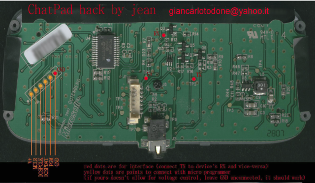
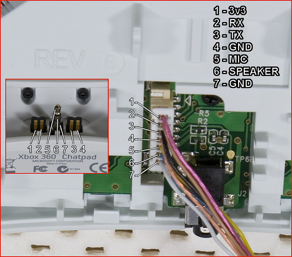

# openKeyboard Chatpad360

This version forked from https://github.com/Neo-Desktop/OpenChatpad360

Calibration word value @ 2009h = 0x3FFF

Note: on my unit baudrate appears to be 5340 bps ( not 4800 as expected )

Update of calibration word from 0x3FFF to 0x2573 gives correct default baudtrate setting of 4800 bps - best value found by experiment.

## software update

Added amended source to build using sdcc, needed library function replacements included in source body.

Note: CPU clock frequency needs testing and tuning.

Note: not yet tested on microcontroller!

Initial verion, builds clean.

[build files](../build/)

## Microchip datasheets

[Pic16f883 datasheet](41291b.pdf)

[Programming spec](41287D.pdf)

## development blog

[Open Keyboard Project](https://forums.ps2dev.org/viewtopic.php?t=9804)

## Serial connections

| Chatpad J1| colour|function|
|-----------|-------|--------|
| 1         | red   |3v3     |
| 2         | brown |Rx      |
| 3         | black |Tx      |
| 4         | oange |Gnd     |
| 5         | yellow|J2 tip  |
| 6         | blue  |J2 ring |
| 7         | white |J2 com  |

Note: j2 com is not connected to Gnd

## Configuration key presses

```
Holding [people] button (that at this point should be called [user settings]) and pressing various keys, you can reconfigure the keyboard on-the-fly and store configuration in internal EEPROM memory.
1) [user settings]+[right] increase backlight luminosity
2) [user settings]+[left] decrease backlight luminosity
3) [user settings]+[s] put keyboard into serial mode
4) [user settings]+[a] put keyboard into scan/advanced mode (still no ps2 mode...not of PSP interest anyway) scan codes are sent as previously stated (1-47, counting buttons from top to bottom, from left to right) bit 6 set for "pressed", bit 7 reserved for future use (bidirectional protocol)
5) [user settings]+[0-9] set backlight duration (0 = no light, 1 = on 2sec...9 = always on)
6) [user settings]+[green]+[5] set baud 4800
6) [user settings]+[green]+[6] set baud 9600
n) other settings yet coded but not interfaced
```

## minipro commands

[Minipro Manual](https://www.mankier.com/1/minipro)

[Minipro Gitlab](https://gitlab.com/DavidGriffith/minipro)

## programing connections

| Chatpad JP1 |         |     |TL866 ICSP|         |
|-------------|---------|-----|----------|---------|
|   1         | V+      |red  | 2        | Vcc     |
|   2         | MCLR    |grey | 1        | Vpp/MCLR|
|   3         | ICSPCLK |grey | 5        | PGC     |
|   4         | ICSPDAT |grey | 4        | PGD     |
|   5         | PGM     |     | n/c      | (6-N/C) |
|   6         | GND     |black| 3        | GND     |


### check programmer

```
david@I7MINT:~/Github/sdcc-examples/test$ minipro -p "PIC16F883@DIP28" -I -D
Found TL866II+ 04.2.132 (0x284)
Device code: 19351299
Serial code: XV8HRFZBRYN6UM0A7RKQ
Activating ICSP...
Chip ID: 0x0101, Rev.0x2000  OK
david@I7MINT:~/Github/sdcc-examples/test$ 
```
## read contents

 * minipro -p "PIC16F883@DIP28" -I -r junk.hex

## write test program

 * minipro -I -d PIC16F883@SOIC28 -w blink_led.hex

## program device

 * minipro -p "PIC16F883@DIP28" -I -c code -e -w openKeyboard.hex
 * minipro -p "PIC16F883@DIP28" -I -m openKeyboard.hex
 * minipro -p "PIC16F883@DIP28" -I -e -c data -w openKeyboard.eeprom.bin
 * minipro -p "PIC16F883@DIP28" -I -e -c config -w openKeyboard.fuses.conf

## eeprom contents

```
0000: FF 04 00 02 80 02
```

## Config fuses

```
word1 = 0x20C4
word2 = 0x3fff
user_id0 = 0x3fff
user_id1 = 0x3fff
user_id2 = 0x3fff
user_id3 = 0x3fff
```

## Pictures

[Disassembly photos](https://web.archive.org/web/20220818021236/http://nuxx.net/gallery/v/acquired_stuff/xbox_360_chatpad/?g2_page=2)





```
The pinout for the 28pin SSOP gives the SSI interface on:
pin 14 - SCLK/SCL
pin 15 - SDI/SDA
pin 16 - SDO

And the UART on:
pin 17 - TX/CK
pin 18 - RX/DT

Tracing the tracks from the J1 header should easily tell you which one they are using for the comms link.

The device supports ISP (in-circuit programming via JP1 header?) on:
pin 24 - PGM
pin 27 - ICSPCLK
pin 28 - ICSPDAT
pin 1 - _MLCR/VPP
```

Controlling leds from pic's PORTC...bit 0 is for general backlight, subsequent (in an order i did not wrote down and don't remember) are to independantly control shift, green, people and red backlights.And, of course, i could half-power each of them in PWM fashion


